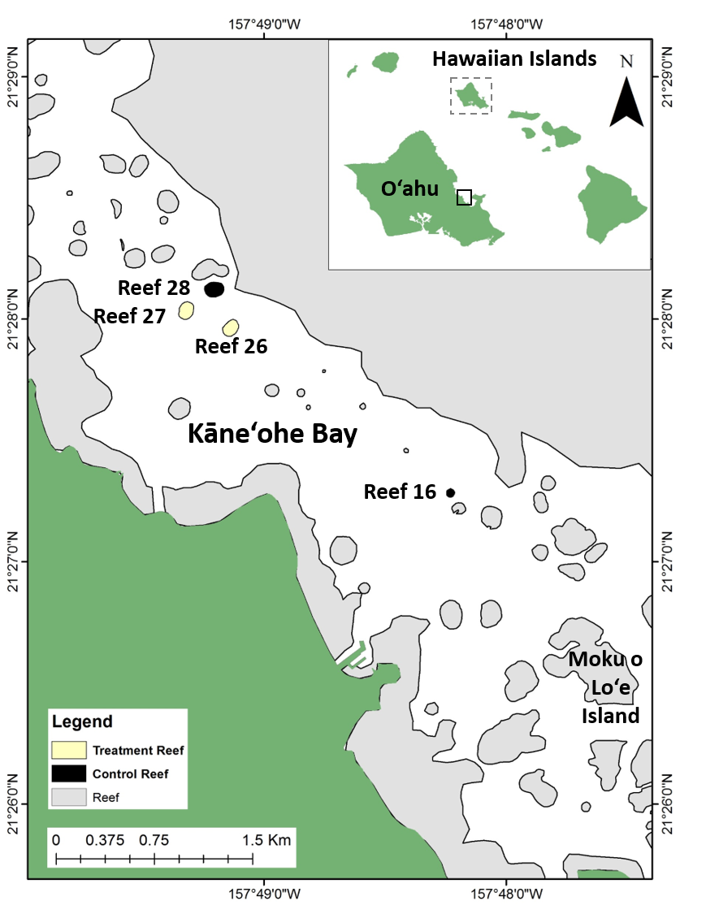
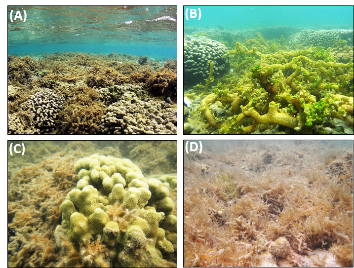
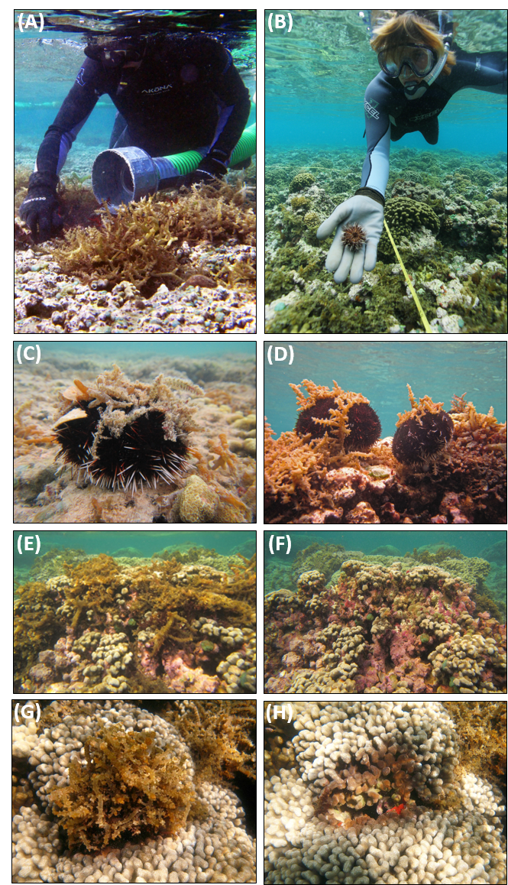

```{r}
knitr::opts_knit$set(root.dir = '~/Desktop/zenodo/DLNR Invasive Algae')
```
Neilson, B. J., C. B. Wall, F. T. Mancini, and C. A. Gewecke. 2018. Herbivore biocontrol and manual removal successfully reduce invasive macroalgae on coral reefs. PeerJ 6: e5332.
https://peerj.com/articles/5332/
  
## Experimental Design
Two experimental treatments were generated:  
**Treatment Reefs: Reef 16 and 27**, where invasive algae were removed and urchins outplanted  
**Control Reefs: Reef 26 and 28**, where no mitigation action was taken  

Reefs were sampled through time at fixed *transects*; this is the **Repeated Measure** of the experiment. These sampling times were repeated twice a year, across **Seasons**: either *Winter (Nov-Feb)* or *Summer (May-June)*. The sampling periods span from 2011 to 2014. The **Before** period marks initial sampling where before mitigation action was taken.
  
- **Before: 2011 Winter**  
- **After1: 2012 Summer**
- **After2: 2012 Winter**
- **After3: 2013 Summer**
- **After4: 2014 Summer**
  

**Figure 1.** *Study site location in Kāne‘ohe Bay on the windward side of the island of O'ahu, Hawai'i, proximate to Moku o Lo'e (Hawai'i Institute of Marine Biology).*

{ width=50% }


## Statistical Design  
*FIXED EFFECTS*  
- **Treatment** = 2 levels (Control and Treatment)    
- **Time** = 5 time points (1 Before and 4 After)   
  
*TEMPORAL RANDOM EFFECTS*  
- **Transect** = the repeated measure (5 points of repeated measure)  
  
*SPATIAL RANDOM EFFECTS*  
- **Reef** = Treatments or Controls are replicated at the Reef scale (n=2)  
- **Habitat** = Habitat is nested within Reef (1|Reef/Habitat). The sampling design at each Reef was stratified according to distinct habitat types (from crest inward): aggregate, pavement, mix).  

## Community Data 
Import the data, load packages, and combine all members of "invasive algae" into a common metric. Data file shows...

- **Factors** (Reef, Treatment, Habitat, Transects, Calendar Date, Time Point, Season)

- **Variables** as the proportion of community cover in dataframe  
- *Ed* = *Eucheuma denticulatum*  
- *Ks* = *Kappaphycus alvarezii*  
- *As* = *Acanthophora spicifera*  
- *Gs* = *Gracilaria salicornia*  
- *Ed_Ks* = *Eucheuma* spp. and *Kappaphycus* sp. 
- *Inv_Ks* = *Eucheuma* spp., *Kappaphycus* sp., *Acanthophora* sp., *Gracilaria* sp.
- *CCA* = Crustose Coralline Algae  
- *Abiotic* = Sand, Bare, Turf  
- *Coral* = Reef corals  
- *NatAlgae* = Native macroalgae  
  
  
{ width=50% }


**Figure 2.** Invasive macroalgae species found on study reefs in Kāne‘ohe Bay. (A) *Eucheuma* clade E, (B) *Kappaphycus* clade B, (C) *Gracilaria salicornia*, (D) *Acanthophora spicifera* (photo credit: Brian Neilson)*

  
Divers removed macroalgae from coral reefs with the aid of the 'Super Sucker': a diver-manned vacuum that removed macroalgae from the reef, which was sorted on a barge with target species removed. Collector urchins (*Tripneustes gratilla*) were raised in hatchiers and outplanted as herbivore biocontrol agents. 
  
    
    
{ width=50% }
  
**Figure 3.** Invasive macroalgae control techniques applied in the field: (A) using the Super Sucker to manually remove *Eucheuma* clade E, (B) outplanting juvenile *Tripneustes gratilla*, (C) outplanted adult *T. gratilla* surrounded by *Gracilaria salicornia* and *Acanthophora spicifera*, (D) adult *T. gratilla* surrounded by *Eucheuma* clade E, (E) before andimmediately (F) after manual removal of *Eucheuma* clade E revealing crustose coralline algae (CCA) and (G) before and (H) after removal of *Eucheuma* clade E revealing live and deadcoral (photo credit: (A-B) DLNR/DAR, (C-H) Brian Neilson).
  
  
```{r, message=FALSE, warning=FALSE}
#clear work space
rm(list=ls())

#load packages
library("lme4")
library("effects")
library("car")
library("gplots")
library("plotrix")
library("ggplot2")
library("grid")
library("gridExtra")
library("scales")
library('MASS') 
library('lsmeans')
library('lmerTest')
library('lmtest')
library("lattice")
library("sjPlot")
```

```{r}
ALLdata<-read.csv("data/InvAlgProjdata_DLNR.csv", header=T, na.string=NA)
# names(ALLdata)

##### examine data structure ######
# str(ALLdata)
ALLdata$Reef<-as.factor(ALLdata$Reef)
ALLdata$Date<-as.Date(ALLdata$Date, format="%m/%d/%y")
ALLdata$Time<-factor(ALLdata$Time, levels=c("Before", "After1", "After2", "After3", "After4"))
###################
```

## Figures
First, we set aside the dataframe above, **ALLdata**. This original dataframe is in proportion, and this will be used in the analysis. We generate a new dataframe, **fig.df**, by converting the proportion data in *ALLdata* to percent cover. Finally, we create a summary dataframe of means, standard error, and sample size for the percent cover data. 

```{r, results="hide"}
### NOTE DATA HERE IS ALL % COVER AND NOT PROPORTION.
### THIS IS OPTIMAL FOR GRAPHS, DATA SUMMARY, AND IN-TEXT SUMMARIES
### IN STATISTICAL MODELS, PROPORTION IS USED FOR AID IN TRANSFORMATION

# percent cover dataframe
fig.df<-ALLdata

fig.df$Abiotic<-(fig.df$Abiotic*100)
fig.df$As<-(fig.df$As*100)
fig.df$CCA<-(fig.df$CCA*100)   
fig.df$Coral<-(fig.df$Coral*100) 
fig.df$Ed<-(fig.df$Ed*100)
fig.df$Ks<-(fig.df$Ks*100)
fig.df$Gs<-(fig.df$Gs*100)
fig.df$NatAlgae<-(fig.df$NatAlgae*100)
fig.df$Inv_Algae<-(fig.df$Inv_Algae*100)
  

# means and SE by Reef, Time for all variables
full.mean.summary<-aggregate(cbind(Inv_Algae, Ed, Ks, As, Gs, CCA, Abiotic, Coral, NatAlgae)~Reef+Treatment+Time, fig.df, mean); colnames(full.mean.summary) <- c("Reef", "Treatment", "Time", "InvAlgae-mean", "ED-mean", "Ks-mean", "AS-mean", "GS-mean", "CCA-mean", "Abiotic-mean", "Coral-mean", "NatAlgae-mean");full.mean.summary

# SE 
full.SE.summary<-aggregate(cbind(Inv_Algae, Ed, Ks, As, Gs, CCA, Abiotic, Coral, NatAlgae)~Reef+Treatment+Time, fig.df, std.error); colnames(full.SE.summary) <- c("Reef", "Treatment", "Time", "InvAlgae-SE", "ED-SE", "KS-SE", "AS-SE", "GS-SE", "CCA-SE", "Abiotic-SE", "Coral-SE", "NatAlgae-SE"); full.SE.summary

# sample size 
full.n.summary<-aggregate(cbind(Inv_Algae, Ed, Ks, As, Gs, CCA, Abiotic, Coral, NatAlgae)~Reef+Treatment+Time, fig.df, length); colnames(full.n.summary) <- c("Reef", "Treatment", "Time", "InvAlgae-n", "ED-n", "KS-n", "AS-n", "GS-n", "CCA-n", "Abiotic-n", "Coral-n", "NatAlgae-n"); full.n.summary


#compiled summary mean, SE, n
full.data.summary<-data.frame(full.mean.summary[c(1:12,0)], full.SE.summary[c(0,4:12)], full.n.summary[c(0,5)]); colnames(full.data.summary) <- c("Reef", "Treatment", "Time", "InvAlgae-mean", "ES-mean", "KS-mean", "AS-mean", "GS-mean", "CCA-mean", "Abiotic-mean", "Coral-mean", "NatAlgae-mean", "InvAlgae-SE", "ED-SE", "KS-SE", "AS-SE", "GS-SE", "CCA-SE", "Abiotic-SE", "Coral-SE", "NatAlgae-SE", "N") ; full.data.summary


#export data summary
#write.csv(full.data.summary, "output/datasummary_updated.csv")
```


Create an individual dataframes of means and SE for figure generation. These are compiled to be **Figure 4**
```{r, results="hide", fig.width=3.5, fig.height=3.5}
#####################################
## General formatting to apply to all figures
par(mfrow = c(1,1), mar=c(5,4,1,1))

pd <- position_dodge(0.1) #offset for error bars
 # theme position for legend in (x,y)
formatting<-(
  theme(panel.border = element_rect(fill=NA, color = "black", size = .1)) +
  theme(legend.key = element_blank()) +
  theme(legend.position = c(0.75,0.86)) +
  theme(text=element_text(size=10))+
  theme(axis.title.x = element_text(size=14))+
  theme(legend.text=element_text(size=10)) +
  theme(legend.title = element_blank())+
  theme(panel.background = element_rect(colour = "black", size=1))+ theme(aspect.ratio=1)+
  theme(axis.ticks.length=unit(-0.25, "cm"), 
        axis.text.y=element_text(margin=unit(c(0.5, 0.5, 0.5, 0.5), "cm")), 
        axis.text.x=element_text(margin=unit(c(0.5, 0.5, 0.5, 0.5), "cm"))))

# axis labels to replace "before and afters"
x.names<-c("Winter\n 2011","Summer\n 2012","Winter\n 2012", "Summer\n 2013", "Winter\n 2013")

############################
#Invasive Algae
Inv.mean<-aggregate(Inv_Algae~Treatment+Time, fig.df, mean)
Inv.SE<-aggregate(Inv_Algae~Treatment+Time, fig.df, std.error)
Inv.df<-data.frame(Inv.mean, Inv.SE[c(3,0)]); colnames(Inv.df) <- c("Treatment", "Time", "mean", "se")
Inv.df["Treat_Time"]<-paste(Inv.df$Treatment, Inv.df$Time)

Fig.InvAlg<-ggplot(data=Inv.df, aes(x=Time, y=mean, group=Treatment, fill=Treatment)) + geom_errorbar(aes(ymin=mean-se, ymax=mean+se),size=.5, width=0, position=pd) +
  geom_line(position=pd, size=.5) +
  coord_cartesian(ylim=c(0, 35)) +
  geom_point(aes(fill=Treatment), position=pd, size=4, pch=21) +
  scale_fill_manual(values=c("white","black"),
                    labels=c("Control", "Treatment")) +
  ylab("Invasive Algae (% cover)") +
  scale_x_discrete(labels=x.names)+
  xlab("Sampling Times") + theme_classic() +
  formatting
# ggsave(file="Fig.InvAlg.eps", dpi=300)

Fig.InvAlg

######################################
# CCA

CCA.mean<-aggregate(CCA~Treatment+Time, fig.df, mean)
CCA.SE<-aggregate(CCA~Treatment+Time, fig.df, std.error)
CCA.df<-data.frame(CCA.mean, CCA.SE[c(3,0)]); colnames(CCA.df) <- c("Treatment", "Time", "mean", "se")
CCA.df["Treat_Time"]<-paste(CCA.df$Treatment, CCA.df$Time)

# plot figure with hab-treat means +/- se using GGPLOT
Fig.CCA<-ggplot(data=CCA.df, aes(x=Time, y=mean, group=Treatment, fill=Treatment)) + geom_errorbar(aes(ymin=mean-se, ymax=mean+se),size=.5, width=0, position=pd) +
  geom_line(position=pd, size=.5) +
  coord_cartesian(ylim=c(0, 35)) +
  geom_point(aes(fill=Treatment), position=pd, size=4, pch=21) +
  scale_fill_manual(values=c("white","black"),
                    labels=c("Control", "Treatment")) +
  ylab("CCA (% cover)")+
  xlab("Sampling Times") + 
  scale_x_discrete(labels=x.names)+
  theme_classic() +
  formatting
# ggsave(file="Fig.CCA.eps", dpi=300)

Fig.CCA

######################################
# Abiotic

Abiot.mean<-aggregate(Abiotic~Treatment+Time, fig.df, mean)
Abiot.SE<-aggregate(Abiotic~Treatment+Time, fig.df, std.error)
Abiot.df<-data.frame(Abiot.mean, Abiot.SE[c(3,0)]); colnames(Abiot.df) <- c("Treatment", "Time", "mean", "se")
Abiot.df["Treat_Time"]<-paste(Abiot.df$Treatment, Abiot.df$Time)

# plot figure with hab-treat means +/- se using GGPLOT
Fig.Abiotic<-ggplot(data=Abiot.df, aes(x=Time, y=mean, group=Treatment, fill=Treatment)) + geom_errorbar(aes(ymin=mean-se, ymax=mean+se),size=.5, width=0, position=pd) +
  geom_line(position=pd, size=.5) +
  coord_cartesian(ylim=c(0, 70)) +
  geom_point(aes(fill=Treatment), position=pd, size=4, pch=21) +
  scale_fill_manual(values=c("white","black"),
                    labels=c("Control", "Treatment")) +
  ylab("Sand/Turf/Bare (% cover)") +
  xlab("Sampling Times") + 
  scale_x_discrete(labels=x.names)+
  theme_classic() +
  formatting
# ggsave(file="Fig.Abiotic.eps", dpi=300)

Fig.Abiotic

######################################
# Coral

Coral.mean<-aggregate(Coral~Treatment+Time, fig.df, mean)
Coral.SE<-aggregate(Coral~Treatment+Time, fig.df, std.error)
Coral.df<-data.frame(Coral.mean, Coral.SE[c(3,0)]); colnames(Coral.df) <- c("Treatment", "Time", "mean", "se")
Coral.df["Treat_Time"]<-paste(Coral.df$Treatment, Coral.df$Time)

# plot figure with hab-treat means +/- se using GGPLOT
Fig.Coral<-ggplot(data=Coral.df, aes(x=Time, y=mean, group=Treatment, fill=Treatment)) + geom_errorbar(aes(ymin=mean-se, ymax=mean+se),size=.5, width=0, position=pd) +
  geom_line(position=pd, size=.5) +
  coord_cartesian(ylim=c(0, 70)) +
  geom_point(aes(fill=Treatment), position=pd, size=4, pch=21) +
  scale_fill_manual(values=c("white","black"),
                    labels=c("Control", "Treatment")) +
  ylab("Coral (% cover)") +
  xlab("Sampling Times") + 
  scale_x_discrete(labels=x.names)+
  theme_classic() +
  formatting
# ggsave(file="Fig.Coral.eps", dpi=300)

Fig.Coral

######################################
# Native Algae

NatAlg.mean<-aggregate(NatAlgae~Treatment+Time, fig.df, mean)
NatAlg.SE<-aggregate(NatAlgae~Treatment+Time, fig.df, std.error)
NatAlg.df<-data.frame(NatAlg.mean, NatAlg.SE[c(3,0)]); colnames(NatAlg.df) <- c("Treatment", "Time", "mean", "se")
NatAlg.df["Treat_Time"]<-paste(NatAlg.df$Treatment, NatAlg.df$Time)

# plot figure with hab-treat means +/- se using GGPLOT
Fig.NatAlg<-ggplot(data=NatAlg.df, aes(x=Time, y=mean, group=Treatment, fill=Treatment)) + geom_errorbar(aes(ymin=mean-se, ymax=mean+se),size=.5, width=0, position=pd) +
  geom_line(position=pd, size=.5) +
  coord_cartesian(ylim=c(0, 35)) +
  geom_point(aes(fill=Treatment), position=pd, size=4, pch=21) +
  scale_fill_manual(values=c("white","black"),
                    labels=c("Control", "Treatment")) +
  ylab("Native Algae (% cover)") +
  xlab("Sampling Times") + 
  scale_x_discrete(labels=x.names)+
  theme_classic() +
  formatting
# ggsave(file="Fig.NatAlg.eps", dpi=300)

############
#export figures
#pdf(file="plots_5time points_InvAlg.pdf")
#grid.arrange(Fig.InvAlg)
#grid.arrange(Fig.CCA, Fig.NatAlg)
#grid.arrange(Fig.Coral, Fig.Abiotic)
#dev.off()
############

Fig.NatAlg
```

Generate a plot with *all the invasive algae groups* plotted individually at Control and Treatment Reefs through time. These are compiled to be **Figure 5**.
```{r, message=FALSE, warning=FALSE, fig.keep="high"}

#Ed dataframe
Ed.mean<-aggregate(Ed~Treatment+Time, fig.df, mean)
Ed.SE<-aggregate(Ed~Treatment+Time, fig.df, std.error)
Ed.df<-data.frame(Ed.mean, Ed.SE[c(3,0)]); colnames(Ed.df) <- c("Treatment", "Time", "mean", "se")
Ed.df["Treat_Time"]<-paste(Ed.df$Treatment, Ed.df$Time)

#Ks dataframe
Ks.mean<-aggregate(Ks~Treatment+Time, fig.df, mean)
Ks.SE<-aggregate(Ks~Treatment+Time, fig.df, std.error)
Ks.df<-data.frame(Ks.mean, Ks.SE[c(3,0)]); colnames(Ks.df) <- c("Treatment", "Time", "mean", "se")
Ks.df["Treat_Time"]<-paste(Ks.df$Treatment, Ks.df$Time)

#As dataframe
As.mean<-aggregate(As~Treatment+Time, fig.df, mean)
As.SE<-aggregate(As~Treatment+Time, fig.df, std.error)
As.df<-data.frame(As.mean, As.SE[c(3,0)]); colnames(As.df) <- c("Treatment", "Time", "mean", "se")
As.df["Treat_Time"]<-paste(As.df$Treatment, As.df$Time)

#Gs dataframe
Gs.mean<-aggregate(Gs~Treatment+Time, fig.df, mean)
Gs.SE<-aggregate(Gs~Treatment+Time, fig.df, std.error)
Gs.df<-data.frame(Gs.mean, Gs.SE[c(3,0)]); colnames(Gs.df) <- c("Treatment", "Time", "mean", "se")
Gs.df["Treat_Time"]<-paste(Gs.df$Treatment, Gs.df$Time)


######## dataframes ##################
# separating Control and Treatment dataframes
Ed.Cn<-Ed.df[(Ed.df$Treatment=="Control"),]
Ed.Tr<-Ed.df[(Ed.df$Treatment=="Treatment"),]

Ks.Cn<-Ks.df[(Ks.df$Treatment=="Control"),]
Ks.Tr<-Ks.df[(Ks.df$Treatment=="Treatment"),]

As.Cn<-As.df[(As.df$Treatment=="Control"),]
As.Tr<-As.df[(As.df$Treatment=="Treatment"),]

Gs.Cn<-Gs.df[(Gs.df$Treatment=="Control"),]
Gs.Tr<-Gs.df[(Gs.df$Treatment=="Treatment"),]


############## properties for plotting figure ############## 
Sample.Times=c(1,2,3,4,5)
Sample.Times2=c(1.02, 2.02, 3.02, 4.02, 5.02) # provides an offset from orignal x
Sample.Times3=c(0.95, 1.95, 2.95, 3.95, 4.95) # provides an offset from orignal x
Species=c(expression(italic("Eucheuma")~clade~E),
          expression(italic("Kappaphycus")~clade~B),
          expression(italic("Acanthophora spicifera")),
          expression(italic("Gracilaria salicornia")))
colors<-c("coral", "yellow3", "cadetblue3", "chartreuse4")


#######################################################
#### Control Reefs with all Invasive Algae species ####
#######################################################

par(mfrow = c(1,2), mar=c(5,4,1,1))

plot(Sample.Times, Ed.Cn$mean, ylab="Macroalgae (% cover)", xaxt="n", type="o", ylim=c(0,18), pch=19, xlab="Sampling Times", cex=1.5, lwd=2, col=colors[1], main="Control Reefs")
axis(side=1, at=Sample.Times, labels=x.names, cex.axis=0.8)
arrows(Sample.Times, Ed.Cn$mean-Ed.Cn$se, Sample.Times, Ed.Cn$mean+Ed.Cn$se, length=0, lwd=2, angle=90, code=3, col=colors[1])
with(Ks.Cn, lines(Sample.Times, mean, xaxt="n", type="o", pch=19, cex=1.5, lwd=2, col=colors[2]))
with(Ks.Cn, arrows(Sample.Times, mean-se, Sample.Times, mean+se, length=0, lwd=2, angle=90, code=3, col=colors[2]))
with(As.Cn, lines(x=Sample.Times2, y=mean, xaxt="n", type="o", pch=19, cex=1.5, lwd=2, col=colors[3]))
with(As.Cn, arrows(Sample.Times2, mean-se, Sample.Times2, mean+se, length=0, lwd=2, angle=90, code=3,col=colors[3]))
with(Gs.Cn, lines(Sample.Times3, mean, xaxt="n", type="o", pch=19, cex=1.5, lwd=2, col=colors[4]))
with(Gs.Cn, arrows(Sample.Times3, mean-se, Sample.Times3, mean+se, length=0, lwd=2, angle=90, code=3, col=colors[4]))


#########################################################
#### Treatment Reefs with all Invasive Algae species ####
#########################################################

plot(Sample.Times, Ed.Tr$mean, ylab="Macroalgae (% cover)",xlab="Sampling Times", xaxt="n", type="o", ylim=c(0,18), pch=19, cex=1.5, lwd=2, col=colors[1], main="Treatment Reefs")
axis(side=1, at=Sample.Times, labels=x.names, cex.axis=0.8)
arrows(Sample.Times, Ed.Tr$mean-Ed.Tr$se, Sample.Times, Ed.Tr$mean+Ed.Tr$se, length=0, lwd=2, angle=90, code=3, col=colors[1])
with(Ks.Tr, lines(Sample.Times2, mean, xaxt="n", type="o", pch=19, cex=1.5, lwd=2, col=colors[2]))
with(Ks.Tr, arrows(Sample.Times2, mean-se, Sample.Times2, mean+se, length=0, lwd=2, angle=90, code=3, col=colors[2]))
with(As.Tr, lines(Sample.Times2, mean, xaxt="n", type="o", pch=19, cex=1.5, lwd=2, col=colors[3]))
with(As.Tr, arrows(Sample.Times2, mean-se, Sample.Times2, mean+se, length=0, lwd=2, angle=90, code=3, col=colors[3]))
with(Gs.Tr, lines(Sample.Times3, mean, xaxt="n", type="o", pch=19, cex=1.5, lwd=2, col=colors[4]))
with(Gs.Tr, arrows(Sample.Times3, mean-se, Sample.Times3, mean+se, length=0, lwd=2, angle=90, code=3, col=colors[4]))
legend("topleft", inset=c(0.02, 0.01), legend=Species, col=colors, pch=19, pt.cex=1.5, cex=0.7, bty="n", x.intersp=0.9, y.intersp=1.3)
```

  
Generate a stacked bar composition plot figure for Before and After for each reef and each treatment.  This is represented as  **Figure 6** in the manuscript.
```{r, results="hide"}

# make dataframe with only rows and columns needed to make figure

##########  means by Reef ID and Time dataframe ########## 
comp.fig.df<-full.mean.summary[, c(1:4,9:12)] # just columns needing to graph
comp.fig.df<-comp.fig.df[(comp.fig.df$Time=="Before" | comp.fig.df$Time=="After4"),] # only show time points "Before" and Final "After4"

colnames(comp.fig.df)<-c("Reef", "Treatment", "Time", "Invasive Algae","CCA", "Sand/Bare/Turf", "Coral", "Native Algae")

# reorder columns
comp.fig.df<-comp.fig.df[, c(1:4, 8,5,7,6)]

# convert wide to long format data 
library("reshape2")
comp.reef.stack.fig<-melt(comp.fig.df, id.vars=1:3)
colnames(comp.reef.stack.fig)<-c("Reef", "Treatment", "Time", "member", "cover")

#colors
stack.palette<-c("darkgreen", "darkseagreen3", "lightcoral", "lightblue", "ivory")

# grouping factor for Time
comp.reef.stack.fig$Time<-factor(comp.reef.stack.fig$Time, levels=c("Before", "After4"))

#### Figxx 
# Fig.stack.reef.trt<-ggplot(comp.reef.stack.fig, aes(x = interaction(Reef, Treatment, lex.order=FALSE), y=cover, fill = member)) + 
#  geom_bar(position = "fill",stat = "identity", colour="black") + 
#  scale_y_continuous(labels = percent_format()) +
#  scale_fill_manual(values=stack.palette, labels=c("Invasive macroalgae", "Native macroalgae", "CCA", "Coral", #"SBT"),  guide = guide_legend(title = "Community members")) + 
#  scale_x_discrete(labels=c("Reef 16\nControl", "Reef 28\nControl", "Reef 26\nTreatment", "Reef 27\nTreatment", #"Reef 16\nControl", "Reef 28\nControl", "Reef 26\nTreatment", "Reef 27\nTreatment")) +
#  ggtitle("Benthic cover over time") +
#  theme(axis.text.x=element_text(size=6))+
#  xlab(expression(bold("Reef and Treatment"))) +
#  ylab(expression(bold(paste("Benthic cover %")))) + facet_grid(.~Time)

# Fig.stack.reef.trt
# ggsave(file="figures/Fig.stack.reef.trt.pdf")

########## ########## ########## ########## ########## ########## 
########## means  by Treatment and Time dataframe ##############
comp.fig.trt<-aggregate(cbind(Inv_Algae, CCA, Abiotic, Coral, NatAlgae)~Treatment+Time, fig.df, mean); colnames(comp.fig.trt) <- c("Treatment", "Time", "Invasive Algae","CCA", "Sand/Bare/Turf", "Coral", "Native Algae")
 
# remove times not wanted for figure
comp.fig.trt<-comp.fig.trt[(comp.fig.trt$Time=="Before" | comp.fig.trt$Time=="After4"),] # only show time points "Before" and Final "After4"

# reorder columns
comp.fig.trt<-comp.fig.trt[, c(1:3,7,4,6,5)]

# convert wide to long format data 
comp.fig.trt<-melt(comp.fig.trt, id.vars=1:2)
colnames(comp.fig.trt)<-c("Treatment", "Time", "member", "cover")

# grouping factor for Time
comp.fig.trt$Time<-factor(comp.fig.trt$Time, levels=c("Before", "After4"))

#### Fig 6
Fig.stack.trt<-ggplot(comp.fig.trt, aes(x =Treatment, y=cover, fill = member)) + 
  geom_bar(position = "fill", stat = "identity", colour="black") + 
  scale_y_continuous(labels = percent_format()) +
  scale_fill_manual(values=stack.palette, labels=c("Invasive macroalgae", "Native macroalgae", "CCA", "Coral", "SBT"),  guide = guide_legend(title = "Community members")) + 
  scale_x_discrete(labels=c("Control", "Algae removal\n + urchins")) +
  ggtitle("Benthic cover over time") +
  theme(axis.text.x=element_text(size=10))+
  xlab(expression(bold("Treatment"))) +
  ylab(expression(bold(paste("Benthic cover %")))) + facet_grid(.~Time)

Fig.stack.trt
# ggsave(file="figures/Fig.stack.trt.pdf")

```
## Statistical analysis
### Assumptions of ANOVA
```{r, results="hide", fig.show="hide"}

# First, check dataframe **ALLdata**. Make a new datarame named **df** and use this for diangostic plots, and run a for loop to insect data and model residuals. *(code below)*  
  
################################################
################################################
# ALLdata = original unmodified proportion data
# use ALLdata dataframe for transformations and ANOVA assumptions
################################################
################################################

# reorganize columns in "ALLdata" and make "df" for subsequent use

df<-ALLdata[, c(1:7,17,8,10,11,15)]

################################################
# for loop for running model, inspecting residuals and diagnostic plots
for(i in 8:12){
  Y<-df[,i]
  full<-lmer(Y~Treatment*Time+(1|Reef/Habitat)+(1|Transect), data=df, na.action=na.exclude)
  R <- resid(full) #save glm residuals
  op<-par(mfrow = c(2,2), mar=c(5,4,1,2), pty="sq")
  plot(full, add.smooth = FALSE, which=1)
  QQ <- qqnorm(R, main = colnames(df)[i]) 
  QQline <- qqline(R)
  hist(R, xlab="Residuals", main = colnames(df)[i])
  plot(df$Treatment, R, xlab="Treatment", ylab="Residuals")
  plot(df$Time, R, xlab="Time", ylab="Residuals")
}
```
    
Most data has non-normal distribution (tests in code above), but *Coral cover* is normally distributed. All other metrics need transformation.  
```{r, results="hide", fig.show="hide", echo=FALSE, eval=FALSE}
# Since data is proportion and distributed 0-1, an arc(sin) or square root transformation may improve.    
# Test *arc-sin squareroot* transformations  *(code below)* 
  
  for(i in 8:12){
  Y<-df[,i]
  full<-lmer(asin(sqrt(Y))~Treatment*Time+(1|Reef/Habitat)+(1|Transect), data=df, na.action=na.exclude)
  R <- resid(full) #save glm residuals
  op<-par(mfrow = c(2,2), mar=c(5,4,1,2), pty="sq")
  plot(full, add.smooth = FALSE, which=1)
  QQ <- qqnorm(R, main = colnames(df)[i]) 
  QQline <- qqline(R)
  hist(R, xlab="Residuals", main = colnames(df)[i])
  plot(df$Treatment, R, xlab="Treatment", ylab="Residuals")
  plot(df$Time, R, xlab="Time", ylab="Residuals")
}

###Now try a *square root transformations*  *(code below)*

for(i in 8:12){
  Y<-df[,i]
  full<-lmer(asin(sqrt(Y))~Treatment*Time+(1|Reef/Habitat)+(1|Transect), data=df, na.action=na.exclude)
  R <- resid(full) #save glm residuals
  op<-par(mfrow = c(2,2), mar=c(5,4,1,2), pty="sq")
  plot(full, add.smooth = FALSE, which=1)
  QQ <- qqnorm(R, main = colnames(df)[i]) 
  QQline <- qqline(R)
  hist(R, xlab="Residuals", main = colnames(df)[i])
  plot(df$Treatment, R, xlab="Treatment", ylab="Residuals")
  plot(df$Time, R, xlab="Time", ylab="Residuals")
}
```
  
- **asin(sqrt(Y))** is good for some metrics *(Invasive algae (pooled), Abiotic)*
- The **square root (Y)** helps other data *(CCA, Native Algae)*
- Others are normally distributed *(Coral cover)*  
  
```{r, echo=FALSE, fig.show="hide", results="hide"}
# Now run diangnostic plots on the dataframe with transformed data in new dataframe. This new dataframe with transformed data will be used in models.

# inspect residuals and q-q plots for this **FINAL** dataframe


Inv.trans<-asin(sqrt(df$Inv_Algae))
CCA.trans<- (df$CCA^0.5)
Abio.trans<- asin(sqrt(df$Abiotic))
Coral.trans<- (df$Coral)
NatAlg.trans<- (df$NatAlgae^0.5)

# transformed dataframe
trans.df<- cbind(df[, c(1:7)], Inv.trans, CCA.trans, Abio.trans, Coral.trans, NatAlg.trans)

################################################
# for loop for running model, inspecting residuals and diagnostic plots
for(i in 8:12){
  Y<-trans.df[,i]
  full<-lmer(Y~Treatment*Time+(1|Reef/Habitat)+(1|Transect), data=trans.df, na.action=na.exclude)
  R <- resid(full) #save glm residuals
  op<-par(mfrow = c(2,2), mar=c(5,4,1,2), pty="sq")
  plot(full, add.smooth = FALSE, which=1)
  QQ <- qqnorm(R, main = colnames(trans.df)[i]) 
  QQline <- qqline(R)
  hist(R, xlab="Residuals", main = colnames(trans.df)[i])
  plot(trans.df$Treatment, R, xlab="Treatment", ylab="Residuals")
  plot(trans.df$Time, R, xlab="Time", ylab="Residuals")
}
```

### Model Selection  
  
Evaluate models and test for seasonal effects
```{r, include=FALSE, message=FALSE, warning=FALSE}
## remember to use the "trans.df" dataframe here, as this is the dataframe with transformed data.

########################################
######### Model Selection ###########
########################################

# first test random effect structure, which is best?
# all fit by REML since this is best with different random effects across models

# for loop running models with different random effects

for(i in 8:12){
  var=trans.df[,i]
  rand1<-lmer(var~Treatment*Time+(1|Habitat)+(1|Reef)+(1|Transect), data=trans.df)
  rand2<-lmer(var~Treatment*Time+(1|Habitat)+(1|Transect), data=trans.df)
  rand3<-lmer(var~Treatment*Time+(1|Transect), data=trans.df)
#### nested models
  rand4<-lmer(var~Treatment*Time+(1|Reef/Habitat)+(1|Transect), data=trans.df)
#### random intercepts
  rand5<-lmer(var~Treatment*Time+(1+Treatment|Habitat)+(1|Transect), data=trans.df)
#### no fixed effects
  null<-lmer(var~1+(1|Habitat)+(1|Reef)+(1|Transect), data=trans.df)
  null2<-lmer(var~1+(1|Reef/Habitat)+(1|Transect), data=trans.df)
#### compare models
  print(AIC(rand1, rand2, rand3, rand4, rand5, null, null2))
  print(anova(rand4, null2))
}

# overall, the best model, across all  appear to be...
# rand4<-lmer(var~Treatment*Time+(1|Reef/Habitat)+(1|Transect), data=trans.df)
```

Testing for season effects, should it be in the model?  
Results (below) show season has no effect and does not need to be included in the model.
  
*Best model* = lmer(var~Treatment*Time+(1|Reef/Habitat)+(1|Transect), data=trans.df)
```{r, message=FALSE, warning=FALSE}
#names(trans.df)
for(i in 8:12){
  var=trans.df[,i]
  mod<-lm(var~Season, data=trans.df)
#### compare models
  print(anova(mod))
}

```

### Linear models
Run through models for all the community response variables. Use post hoc tests for multiple comparisons.
  
```{r, include=FALSE, eval=FALSE}
#### Remember to use the "trans.df" dataframe here, as this is the dataframe with transformed data.

# To explore all effects, fixed or random effect, predicted values, model residuals, can use the following code
# plot(allEffects(full))
# dotplot(ranef(full, condVar=T))
# sjp.lmer(full, type="re.qq")
# plot(full)
# sjp.lmer(full, type="pred", facet.grid=FALSE, vars=c("Treatment","Time"))

## other diagnostics
# sjp.lmer(full)
# sjp.lmer(full, type="pred", vars=c("Treatment","Time")) # each single plot, non-lattice
# qqnorm(ranef(full)$Transect[,1]); qqline(ranef(full)$Transect[,1])
# sjp.lmer(full, type="rs.ri") # if using random slope and random intercept model
# sjp.lmer(full, facet.grid=FALSE, type="ri.slope")
```
  
    
    
####Invasive Algae
```{r, message=FALSE, warning=FALSE}
####################
# Invasive Algae
####################
# dataframe for models is "trans.df"

full<-lmer(Inv.trans~Treatment*Time+(1|Reef/Habitat)+(1|Transect), data=trans.df)
# summary(full)
anova(full, type=2) # THIS is the stats table

# difflsmeans(full, test.effs="Treatment:Time", adjust=Tukey)

detach("package:lmerTest", unload=TRUE)
posthoc<-lsmeans(full, pairwise~Treatment|Time)
cld(posthoc, Letters=letters)
```
  
    
    
####Coral
```{r, message=FALSE, warning=FALSE}
####################
# Coral 
library('lmerTest')
####################
# random intercepts and random Treatment slope 
full<-lmer(Coral.trans~Treatment*Time+(1|Reef/Habitat)+(1|Transect), data=trans.df, na.action=na.exclude)

# summary(full)
anova(full, type=2)
# difflsmeans(full, test.effs="Treatment:Time", adjust=Tukey)

detach("package:lmerTest", unload=TRUE)
posthoc<-lsmeans(full, pairwise~Treatment|Time)
cld(posthoc, Letters=letters)
```
   
####CCA
```{r, message=FALSE, warning=FALSE}
####################
# CCA
library('lmerTest')
####################
full<-lmer(CCA.trans~Treatment*Time+(1|Reef/Habitat)+(1|Transect), data=trans.df, na.action=na.exclude)

# summary(full)
anova(full, type=2)
# difflsmeans(full, test.effs="Treatment:Time", adjust=Tukey)

detach("package:lmerTest", unload=TRUE)
posthoc<-lsmeans(full, pairwise~Treatment|Time)
cld(posthoc, Letters=letters)
```
  
    
####Native Algae
```{r, message=FALSE, warning=FALSE}
####################
# Native Algae
library('lmerTest')
####################
full<-lmer(NatAlg.trans~Treatment*Time+(1|Reef/Habitat)+(1|Transect), data=trans.df, na.action=na.exclude)

# summary(full)
anova(full, type=2)
# difflsmeans(full, test.effs="Treatment:Time", adjust=Tukey)

detach("package:lmerTest", unload=TRUE)
posthoc<-lsmeans(full, pairwise~Treatment|Time)
cld(posthoc, Letters=letters)
```
  
    
####Abiotic
```{r, message=FALSE, warning=FALSE}
####################
# Abiotic
library('lmerTest')
####################
full<-lmer(Abio.trans~Treatment*Time+(1|Reef/Habitat)+(1|Transect), data=trans.df, na.action=na.exclude)

# summary(full)
anova(full, type=2)
# difflsmeans(full, test.effs="Treatment:Time", adjust=Tukey)

detach("package:lmerTest", unload=TRUE)
posthoc<-lsmeans(full, pairwise~Treatment|Time)
cld(posthoc, Letters=letters)
```
